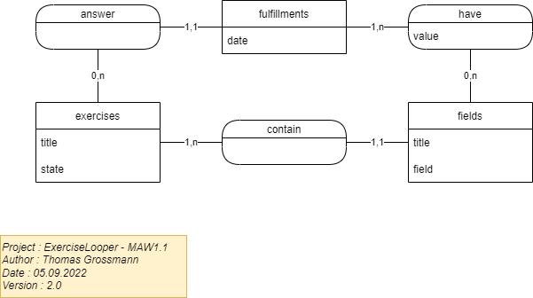
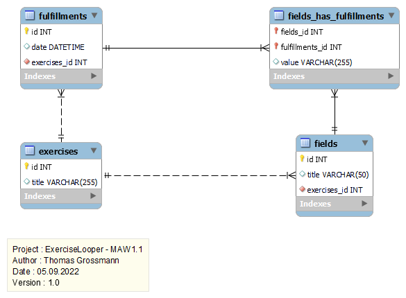

# Documentation ExerciseLooper - Semi-Croustillants

## Modèle Conceptuel


## Modèle Logique


## Mise en place environement

### Prérequis
- PHP (Version utilisée : **8.1.9**)
  - Extension PDO activée (changer `;extension=pdo_mysql` par `extension=pdo_mysql` dans le fichier `php.ini`)
- MySQL (Version utilisée : **15.1 Distrib 10.9.1-MariaDB**)
  - **Avoir la base de données**
    - Se connecter avec un client SQL de votre choix et éxecuter le fichier `Create_DB.sql` qui crée la base de données du site. Les données pourront être insérées en utilisant les fonctionnalités du site directement.
- Un IDE de votre choix (développement initial effectué depuis Visual Studio Code)
- PHP Composer (https://getcomposer.org/download/)

### Procédure
1. Récuperer le repository depuis Github (clone, fork ou téléchargement .zip) (https://github.com/CPNV-ES/ExerciseLooper-TGN-NBI)
1. Faire un `composer install` à la racine du projet
1. Ouvrir le fichier `config.exemple.ini` et remplir les " " avec vos informations.
   1. Renommer le fichier en `config.ini`
1. Lancer le serveur PHP via la commande `php -S 127.0.0.1:8080 -t public`

## Structure du projet
- **documentation/**
Ce dossier contient les documents nécessaires à la documentation du projet (MCD, MLD, Scripts SQL).
- **public/**
Ce dossier contient l'index du projet et les ressources Images/CSS/JS s'il y en a.
- **src/**
  Ce dossier contient tous les fichiers du projet.
  - **config/**
    - Ce dossier contient le fichier de config pour les accès à la base de données (non commité évidemment mais avec un fichier d'exemple vide à remplir).
  - **controllers/**
    - Ce dossier contient les controllers de l'application, ceux-ci héritent d'un controller de base qui contient une instance du router ainsi qu'un redirect.
  - **models/**
    - Ce dossier contient les models de l'application, ceux-ci héritent d'un modèle de base qui contient toutes les actions "par défaut" liées à la base de données (CRUD).
  - **renderer/**
    - Ce dossier contient le fichier renderer, qui se charge de retourner le contenu qui sera affiché dans les vues.
  - **router/**
    - Ce dossier contient le router de l'application.
  - **views/**
    - Ce dossier contient toutes les vues du site découpées par objets (vues exercise, vues fields etc...) ainsi que les erreurs et templates.
  - **routes.php**
    - Ce fichier contient toutes les routes de l'application, celles-ci font appel à une méthode contenue dans un controller.
- **vendor** (dossier généré avec `composer install`)

## Fonctionnement du projet

### Structure MVC

Le projet fonctionne sur une structure MVC (Model - View - Controller), cette structure permet une meilleure organisation du code en le découpant en trois parties.

Pour ajouter une nouvelle fonctionnalité il faudra ajouter plusieurs fichiers et du code à  différents endroits.

### Modèles
Pour créer un nouveau model, il faut ajouter un ficher dans le dossier models et de créer une classe qui hérite de "Model".

```php 
class MyModel extends Model
```

Cet héritage vous permet d'utiliser les méthodes "select, update, insert et delete", celles-ci vous permettent de réaliser toutes les actions CRUD.

##### Paramètres de la méthode "select"
- **_table_** : Nom de la table où chercher les données
- **_fields_** : Colonnes de la table que l'on veut récupérer (par ex. "`*`")
- **_where_** (optionnel) : Condition optionnelle de la requête (par ex. "`id = 1`")

##### Paramètres de la méthode "update"
- **_table_** : Nom de la table où se trouvent les données que l'on veut modifier
- **_fields_** : Colonnes de la table que l'on veut modifier
- **_values_** : Nouvelles valeurs qui remplacent les anciennes
- **_where_** : Condition de la requête (par ex. "`id = 1`")

##### Paramètres de la méthode "insert"
- **_table_** : Nom de la table où l'on veut insérer des données
- **_fields_** : Colonnes de la table
- **_values_** : Données à insérer dans la table

##### Paramètres de la méthode "delete"
- **_table_** : Nom de la table où l'on veut supprimer des données
- **_where_** : Condition de la requête (par ex. "`id = 1`")

### Contrôleurs
Pour créer un nouveau model, il faut ajouter un ficher dans le dossier controllers et de créer une classe qui hérite de "Controller".

```php
class MyController extends Controller
```

Cet héritage vous permet d'utiliser les méthodes "render et redirect".
La méthode render permet de rendre une vue qui se trouve dans le dossier views.

##### Paramètres de la méthode "render"
- **_template_** : Nom du fichier du template (se trouvant sous `src/views/templates`)
- **_content_** : Nom du fichier de la vue voulue
- **_data_** : Contenu que l'on veut passer à la vue

##### Paramètres de la méthode "redirect"
- **_route_** : Nom de la route requis pour accéder aux bonnes ressources (par ex. `'edit'`)
- **_params_** : Paramètres passés à la route requis pour afficher les bonnes données (par ex. `['id' => $id]` afin d'afficher un détail)

### Vues
Toutes les vues du site se trouvent sous `src/views` et sont séparées par dossier (les vues exercises sont séparées des vues fulfillments, etc...).
Elles sont toutes basées sur un template `template.php` se trouvant son dossier `templates/`.

Pour ajouter une nouvelle vue :
- Créer un nouveau fichier `.php` dans le dossier correspondant
- Écrire l'HTML de la vue dans ce fichier
  - Il faut seulement que le contenu de la vue se trouve entre des balises `<main class="container"></main>`, pas besoin de réecrire l'HTML en entier.

### Routes
Les routes sont toutes définies dans un seul fichier `routes.php` se trouvant dans `src/`.

Exemple d'une route : `$router->post('/exercises/:id/delete', "exercise#delete", "deleteExercise");`

Qui est donc construite avec :
- La méthode HTTP (GET ou POST), en pointant sur une méthode du router (get() ou post())
- Le "chemin" de la route entre, ce qui sera affiché dans l'URL
  - S'il y a des IDs à passer dans la route, utiliser `:id`
- Le nom du contrôleur et le nom de la méthode séparés par un `#`
- Le nom de la route en elle-même (optionnel)
